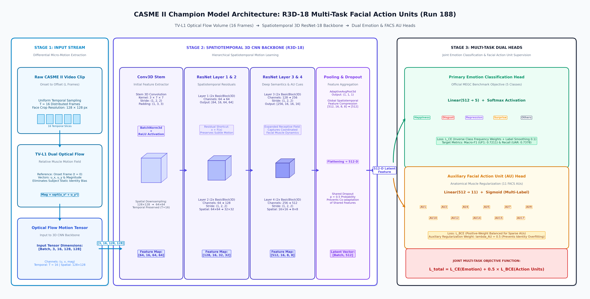

# CASME II Micro-Expression Recognition (MER)

Repositori penelitian dan pengembangan model *deep learning* untuk pengenalan mikro-ekspresi wajah (*Facial Micro-Expression Recognition*) pada dataset benchmark **CASME II** (246 video klip teranotasi, 26 subjek), dievaluasi secara ketat pada **5 Kelas Standar MEGC** (*Micro-Expression Grand Challenge*): **Happiness**, **Disgust**, **Repression**, **Surprise**, dan **Others**.

Pendekatan utama repositori ini mengombinasikan **Volume Aliran Optik Diferensial TV-L1** (eliminasi bias identitas statis) dengan arsitektur **Spatiotemporal 3D CNN (R3D-18)** dan supervisi ganda **Multi-Task Facial Action Units (FACS AU)** sebagai regularisasi anatomi otot wajah.

---

## 1. Struktur Repositori

Repositori ini menerapkan tata kelola kode dan artefak modular dengan pemisahan peran yang ketat, dijaga oleh pengujian integritas otomatis (`tests/test_structure.py`):

```
casmeII-new-from-sequence-model/
│
├── configs/                     # Definisi konfigurasi eksperimen terstandardisasi
│   ├── NNN_nama.json            # File konfigurasi JSON bernomor 3-digit kronologis (e.g., 188_r3d_au05.json)
│   └── protocols/               # Protokol split evaluasi resmi (LOSO 26, dev LOSO 21, grouped 4-fold)
│
├── src/casme/                   # Paket modul Python utama (casme core package)
│   ├── data/                    # Dataset loader, frame extraction, dan LOSO split builder
│   ├── models/                  # Arsitektur jaringan: R3D-18, Multi-Task AU, ViViT, GCN-GRU, Temporal Transformer
│   ├── features/                # Ekstraksi fitur TV-L1 flow, strain tensor, landmark graph, dan ResNet spatial
│   ├── training/                # Training engine, Loss builders (Focal, Class-Weighted CE, BCE), optimizer & scheduler
│   ├── evaluation/              # Metrik standar MEGC (UF1, UAR, ACC, Specificity, AUC) dan paired bootstrap gating
│   ├── reporting/               # Otomasi pengumpulan hasil runs ke results.csv dan generator laporan LAPORAN.md
│   ├── serving/                 # Runtime inference offline video, apex locator, dan Test-Time Augmentation (TTA)
│   ├── tools/                   # Utilitas preprocessing (magnification, face ROI alignment, flow generator)
│   └── paths.py                 # Single source of truth untuk path kanonikal di seluruh lingkungan kerja
│
├── runs/                        # Direktori artefak hasil setiap eksperimen (NNN_nama/)
│   └── 188_r3d_au05_.../        # Log per-epoch, per_fold.csv, confusion_matrix.png, roc_curve.png, probs.npz
│
├── results/                     # Rekapitulasi metrik numerik resmi
│   ├── results.csv              # Single source of truth seluruh skor eksperimen
│   └── results_protocol_v2.csv  # Log ledger audit protokol pengujian v2
│
├── reports/                     # Laporan kompilasi eksperimen resmi
│   └── LAPORAN.md               # Dokumen laporan terpadu yang digenerate otomatis dari results.csv
│
├── docs/                        # Dokumentasi teknis mendalam dan publikasi
│   ├── paper_progression_narrative.md        # Alur narasi progresif terkurasi & Master Progression Table untuk paper
│   ├── laporan_eksperimen_terbaik_casme2.md  # Laporan komprehensif model-model terbaik (analisis detail & kurva)
│   ├── architecture_r3d_multitask_au.png     # Diagram arsitektur visual resmi model juara (300 DPI)
│   ├── INFERENCE_GUIDE.md                    # Panduan inferensi video offline dan penggunaan checkpoint
│   └── tought-process.md                     # Catatan desain algoritma dan analisis kegagalan/keberhasilan
│
├── scripts/                     # Skrip otomatisasi shell untuk replikasi dan testing
│   ├── check.sh                 # Menjalankan seluruh rangkaian 36 unit test dan structural test
│   ├── run_queue.sh             # Menjalankan antrean eksperimen berdasarkan ID/prefix konfigurasi
│   ├── run_loso26.sh            # Menjalankan evaluasi penuh LOSO 26-Fold benchmark CASME II
│   └── rebuild_reports.sh       # Membangun ulang results.csv dan LAPORAN.md tanpa perlu training ulang
│
├── deploy/                      # Skrip inferensi dan deployment mandiri
│   └── app_predict.py           # Pipeline inferensi video end-to-end (video upload -> prediksi emosi)
│
├── tests/                       # Rangkaian pengujian otomatis (regression & integrity guards)
│   ├── test_structure.py        # Pengawal struktur direktori dan larangan file liar di root
│   ├── test_protocol_v2.py      # Pengawal determinisme split dan paired bootstrap test
│   ├── test_eval_pipeline.py    # Pengujian konsistensi metrik evaluasi dan TTA
│   └── test_flow_pipeline.py    # Pengujian stabilitas aliran optik TV-L1 dan ECC motion compensation
│
├── scratch/                     # Skrip analisis pendukung, generator kurva visual, dan inspeksi
│   ├── draw_architecture.py     # Skrip generator diagram arsitektur model publikasi
│   └── generate_artifacts.py    # Skrip generator kurva ROC multi-kelas dan kurva pembelajaran
│
├── .gitignore                   # Proteksi privasi dataset berlisensi, model weights besar (*.pt), dan log antrean
├── AGENTS.md                    # Panduan aturan agen pengembang (privasi lisensi dataset & disiplin git commit)
├── CLAUDE.md                    # Panduan teknis dan batasan arsitektural proyek
└── pyproject.toml               # Konfigurasi instalasi paket casme (PEP 517/621)
```

---

## 2. Arsitektur Model Juara (R3D-18 Multi-Task Action Units)

Tantangan utama pada pengenalan mikro-ekspresi adalah durasi yang amat singkat (< 0,5 detik), deformasi otot wajah yang sangat halus (< 1–2 piksel), serta kerentanan model deep learning terhadap *identity overfitting* (menghafal wajah orang alih-alih dinamika gerak ototnya).

Model terbaik kami (**Run 188**) memecahkan tantangan ini melalui arsitektur terintegrasi berikut:



### Rincian Tiga Tahapan Arsitektur:
1. **Stage 1: Input Stream (Differential Micro-Motion)**:
   * Klip video dari frame *onset* hingga *offset* disampling secara merata menjadi $T = 16$ frame temporal pada resolusi wajah $128 \times 128$ piksel.
   * Medan aliran optik **TV-L1** dihitung relatif terhadap frame onset:
     $$\mathbf{u}_t = (u_x, u_y), \quad \text{Magnitude} = \sqrt{u_x^2 + u_y^2}$$
   * Representasi ini secara inheren mengeliminasi tekstur wajah statis (warna kulit, fitur identitas) dan menghasilkan tensor gerak diferensial murni berukuran $[B, 3, 16, 128, 128]$.
2. **Stage 2: Spatiotemporal 3D CNN Backbone (R3D-18)**:
   * Fitur diekstraksi secara hierarkis melalui `Conv3D Stem` ($3 \times 7 \times 7$), berlanjut ke `ResNet Layer 1 & 2` ($64 \to 128$ channel) dengan koneksi residual untuk menjaga deformasi mikro.
   * `ResNet Layer 3 & 4` ($256 \to 512$ channel) memperluas receptive field untuk menangkap pola koordinasi antar-kelompok otot wajah.
   * `AdaptiveAvgPool3d((1, 1, 1))` mereduksi dimensi spatiotemporal penuh menjadi vektor laten $512$-dimensi yang diregularisasi dengan `Dropout(p = 0.5)`.
3. **Stage 3: Multi-Task Dual Heads & Joint Objective**:
   * **Kepala Emosi Utama**: Memproyeksikan fitur laten ke 5 kelas MEGC melalui `Linear(512 -> 5)` + Softmax dengan fungsi loss Cross-Entropy terbobot frekuensi terbalik dan *label smoothing* 0.1:
     $$\mathcal{L}_{\text{CE}}(\hat{y}, y)$$
   * **Kepala Tambahan Facial Action Units (AU)**: Memproyeksikan fitur laten yang sama ke 11 unit aksi otot FACS (`AU1`, `AU2`, `AU4`, `AU5`, `AU7`, `AU9`, `AU10`, `AU12`, `AU14`, `AU15`, `AU17`) melalui `Linear(512 -> 11)` + Sigmoid dengan loss binary cross-entropy terbobot positif:
     $$\mathcal{L}_{\text{BCE}}(\hat{a}, a)$$
   * **Fungsi Objektif Gabungan**:
     $$\mathcal{L}_{\text{total}} = \mathcal{L}_{\text{CE}}(\text{Emotion}) + 0.5 \times \mathcal{L}_{\text{BCE}}(\text{Action Units})$$
     Supervisi AU bertindak sebagai *inductive bias* yang memaksa backbone mempelajari pergerakan otot fisiologis wajah manusia yang sahih.

---

## 3. Hasil Benchmark Model Terbaik (CASME II 5-Kelas MEGC)

Evaluasi model diuji menggunakan protokol resmi **Leave-One-Subject-Out (LOSO) 26-Fold Penuh** (seluruh 246 klip video pada 26 subjek tanpa kebocoran data subjek):

| Run | Arsitektur & Strategi | Protokol | Akurasi (ACC) | Macro-F1 (UF1) | Recall (UAR) | Specificity | Macro-AUC | Artefak Visual & Log |
| :---: | :--- | :---: | :---: | :---: | :---: | :---: | :---: | :--- |
| [`188`](runs/188_r3d_au05_full_s42_v2_dev_loso_all_p5) | **R3D-18 + 11-AU Multi-Task (Champion)** | **LOSO 26** (246 klip) | **69,92%** | **0,7211** | **0,7378** | **91,70%** | **0,8949** | [Diagram](runs/188_r3d_au05_full_s42_v2_dev_loso_all_p5/architecture.png) • [Matrix](runs/188_r3d_au05_full_s42_v2_dev_loso_all_p5/confusion_matrix.png) • [ROC](runs/188_r3d_au05_full_s42_v2_dev_loso_all_p5/roc_curve.png) • [Kurva](runs/188_r3d_au05_full_s42_v2_dev_loso_all_p5/curve_training.png) • [Log](runs/188_r3d_au05_full_s42_v2_dev_loso_all_p5/run.log) |
| [`017`](runs/017_r3d) | R3D-18 Pure TV-L1 Flow Baseline | **LOSO 26** (246 klip) | **68,70%** | **0,7145** | **0,7207** | **91,04%** | **0,8948** | [Matrix](runs/017_r3d/confusion_matrix.png) • [ROC](runs/017_r3d/roc_curve.png) • [Kurva](runs/017_r3d/curve_training.png) • [Log](runs/017_r3d/run.log) |
| [`182`](runs/182_r3d_focus_region_full_s42_v2_dev_loso_all_p5) | R3D-18 + Facial Region Focus Attention | **LOSO 26** (246 klip) | **69,51%** | **0,7121** | **0,7271** | **91,58%** | **0,8964** | [Matrix](runs/182_r3d_focus_region_full_s42_v2_dev_loso_all_p5/confusion_matrix.png) • [ROC](runs/182_r3d_focus_region_full_s42_v2_dev_loso_all_p5/roc_curve.png) • [Kurva](runs/182_r3d_focus_region_full_s42_v2_dev_loso_all_p5/curve_training.png) • [Log](runs/182_r3d_focus_region_full_s42_v2_dev_loso_all_p5/run.log) |
| [`203`](runs/203_expD_flow_strain_v2_dev_loso_all_p5) | R3D-18 + Flow & Strain Tensor ($\varepsilon_{xx}, \varepsilon_{yy}$) | **LOSO 26** (246 klip) | **68,29%** | **0,6938** | **0,7046** | **91,36%** | **0,8923** | [Matrix](runs/203_expD_flow_strain_v2_dev_loso_all_p5/confusion_matrix.png) • [ROC](runs/203_expD_flow_strain_v2_dev_loso_all_p5/roc_curve.png) • [Kurva](runs/203_expD_flow_strain_v2_dev_loso_all_p5/curve_training.png) • [Log](runs/203_expD_flow_strain_v2_dev_loso_all_p5/run.log) |

> 📖 **Dokumentasi & Narasi Publikasi Paper**:
> - **Alur Narasi 6 Babak & Master Progression Table untuk Paper**: [docs/paper_progression_narrative.md](docs/paper_progression_narrative.md)
> - **Laporan Komprehensif Model Terbaik & Kurva Per-Epoch**: [docs/laporan_eksperimen_terbaik_casme2.md](docs/laporan_eksperimen_terbaik_casme2.md)

---

## 4. Panduan Menjalankan Kode (Quickstart)

### A. Persiapan Lingkungan (Environment Setup)
Pastikan lingkungan Conda aktif dengan PyTorch bertarget GPU (CUDA):
```bash
conda activate facesleuth
```

### B. Menjalankan Uji Integritas & Unit Tests
Selalu verifikasi integritas kode dan struktur proyek dengan perintah:
```bash
bash scripts/check.sh
```
*Skrip ini mengeksekusi 36 uji unit otomatis mencakup pipeline evaluasi, konsistensi aliran optik, protokol split, dan kebersihan struktur root.*

### C. Menjalankan Antrean Eksperimen
Jalankan satu atau beberapa konfigurasi eksperimen dari folder `configs/`:
```bash
# Menjalankan run spesifik berdasarkan nomor/nama config:
bash scripts/run_queue.sh 188

# Menjalankan evaluasi penuh benchmark Leave-One-Subject-Out 26-Fold:
bash scripts/run_loso26.sh
```

### D. Mengompilasi Ulang Laporan & Tabel Metrik
Jika ingin meregenerasi tabel ringkasan `results/results.csv` dan laporan `reports/LAPORAN.md` dari folder runs yang ada:
```bash
bash scripts/rebuild_reports.sh
```

### E. Menjalankan Inferensi Video Mandiri
Untuk melakukan inferensi mikro-ekspresi pada video baru:
```bash
python deploy/app_predict.py --video path/to/sample.avi --model runs/188_r3d_au05_full_s42_v2_dev_loso_all_p5
```

---

## 5. Kebijakan & Aturan Pengembangan

1. **Privasi Dataset Berlisensi**: Dataset CASME II merupakan dataset akademik berlisensi resmi. Dilarang keras melakukan commit atau mempublikasikan file video/gambar mentah dataset ke repositori publik. Pemrosesan data dilakukan melalui pipeline programatik lokal.
2. **Kebersihan Root Direktori**: Tidak diperkenankan meletakkan script liar (`.py`, `.sh`), file data (`.csv`), atau log (`.log`) di root direktori. Seluruh kode harus berada di bawah paket `src/casme/`, `scripts/`, atau `deploy/`.
3. **Standar Riwayat Git**: Perubahan kode wajib dipecah menjadi unit-unit commit kecil yang modular (*atomic commits*) dengan pesan deskriptif berbahasa Inggris sesuai konvensi Conventional Commits (`feat:`, `fix:`, `docs:`, `chore:`).
