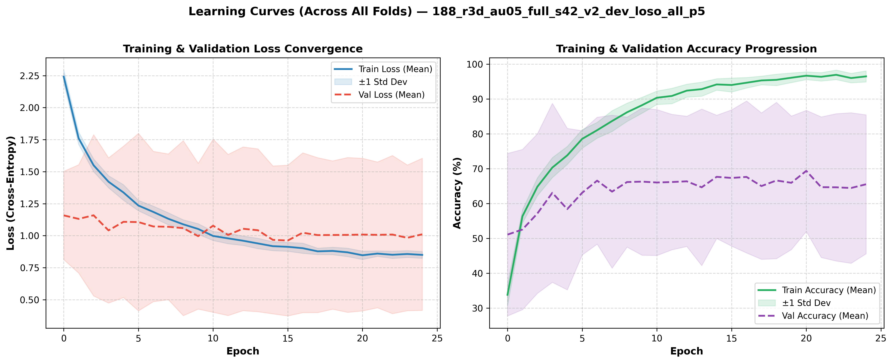
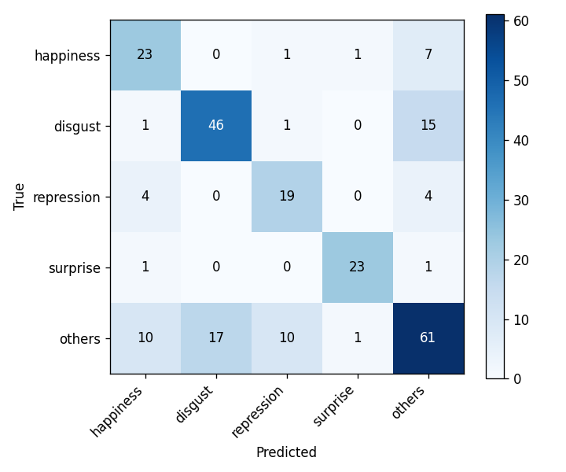
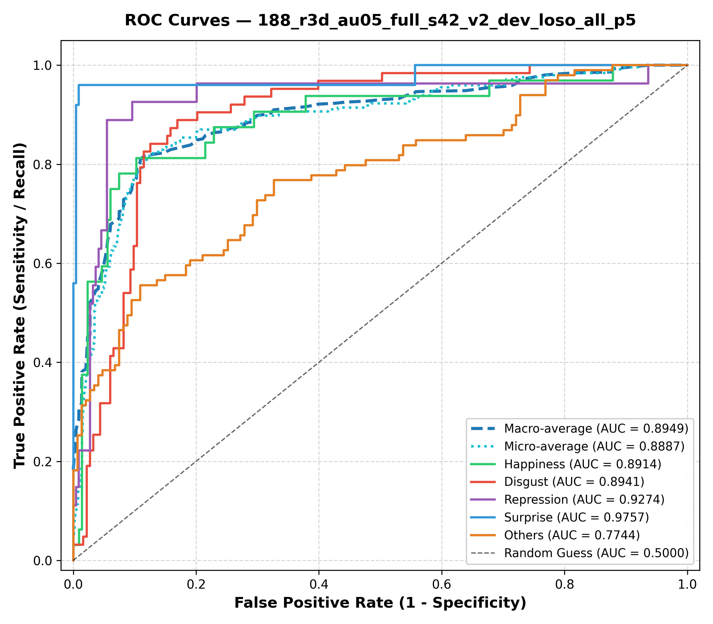

# Laporan Eksperimen Model Terbaik: CASME II Micro-Expression Recognition

Dokumen ini menyajikan laporan komprehensif hasil pengujian model-model terbaik pada benchmark pengenalan mikro-ekspresi wajah **CASME II** (5-Kelas Standar MEGC), dievaluasi secara ketat menggunakan protokol **Leave-One-Subject-Out (LOSO) 26-Fold Penuh** (seluruh 246 klip video).

Laporan ini membedah arsitektur model juara, skenario eksperimen, dinamika pelatihan per-epoch dan per-fold, hasil pengujian testing, serta analisis kurva ROC dan nilai AUC.

---

## 1. Ringkasan Eksekutif & Tabel Master Model Terbaik

Berikut adalah rekapitulasi performa model-model terbaik yang telah dikembangkan dan divalidasi. Seluruh tautan pada tabel di bawah ini terhubung langsung ke direktori artefak masing-masing di repositori sehingga dapat langsung diklik dan ditinjau:

| Run | Model & Strategi | Protokol Split | Akurasi (ACC) | Macro-F1 (UF1) | Recall (UAR) | Specificity | Macro-AUC | Artefak Visual & Log |
| :--- | :--- | :---: | :---: | :---: | :---: | :---: | :---: | :--- |
| [`188`](../runs/188_r3d_au05_full_s42_v2_dev_loso_all_p5) | **R3D-18 + 11-AU Multi-Task (Champion)** | **LOSO 26** (246 sampel) | **69,92%** | **0,7211** | **0,7378** | **91,70%** | **0,8949** | [Diagram Arsitektur](../runs/188_r3d_au05_full_s42_v2_dev_loso_all_p5/architecture.png) • [Confusion Matrix](../runs/188_r3d_au05_full_s42_v2_dev_loso_all_p5/confusion_matrix.png) • [ROC Curve](../runs/188_r3d_au05_full_s42_v2_dev_loso_all_p5/roc_curve.png) • [Kurva Training](../runs/188_r3d_au05_full_s42_v2_dev_loso_all_p5/curve_training.png) • [Per-Fold CSV](../runs/188_r3d_au05_full_s42_v2_dev_loso_all_p5/per_fold.csv) • [Log](../runs/188_r3d_au05_full_s42_v2_dev_loso_all_p5/run.log) |
| [`017`](../runs/017_r3d) | R3D-18 Pure TV-L1 Flow Baseline | **LOSO 26** (246 sampel) | **68,70%** | **0,7145** | **0,7207** | **91,04%** | **0,8948** | [Confusion Matrix](../runs/017_r3d/confusion_matrix.png) • [ROC Curve](../runs/017_r3d/roc_curve.png) • [Kurva Training](../runs/017_r3d/curve_training.png) • [Per-Fold CSV](../runs/017_r3d/per_fold.csv) • [Log](../runs/017_r3d/run.log) |
| [`182`](../runs/182_r3d_focus_region_full_s42_v2_dev_loso_all_p5) | R3D-18 + Facial Region Focus Attention | **LOSO 26** (246 sampel) | **69,51%** | **0,7121** | **0,7271** | **91,58%** | **0,8964** | [Confusion Matrix](../runs/182_r3d_focus_region_full_s42_v2_dev_loso_all_p5/confusion_matrix.png) • [ROC Curve](../runs/182_r3d_focus_region_full_s42_v2_dev_loso_all_p5/roc_curve.png) • [Kurva Training](../runs/182_r3d_focus_region_full_s42_v2_dev_loso_all_p5/curve_training.png) • [Per-Fold CSV](../runs/182_r3d_focus_region_full_s42_v2_dev_loso_all_p5/per_fold.csv) • [Log](../runs/182_r3d_focus_region_full_s42_v2_dev_loso_all_p5/run.log) |
| [`203`](../runs/203_expD_flow_strain_v2_dev_loso_all_p5) | R3D-18 + Flow & Strain Tensor ($\varepsilon_{xx}, \varepsilon_{yy}$) | **LOSO 26** (246 sampel) | **68,29%** | **0,6938** | **0,7046** | **91,36%** | **0,8923** | [Confusion Matrix](../runs/203_expD_flow_strain_v2_dev_loso_all_p5/confusion_matrix.png) • [ROC Curve](../runs/203_expD_flow_strain_v2_dev_loso_all_p5/roc_curve.png) • [Kurva Training](../runs/203_expD_flow_strain_v2_dev_loso_all_p5/curve_training.png) • [Per-Fold CSV](../runs/203_expD_flow_strain_v2_dev_loso_all_p5/per_fold.csv) • [Log](../runs/203_expD_flow_strain_v2_dev_loso_all_p5/run.log) |
| [`163`](../runs/163_r3d_regionattn_full_s42_v2_dev_loso_dev_p5) | R3D-18 + Multi-Region Soft Attention | **LOSO 21** (192 sampel dev) | **71,35%** | **0,7283** | **0,7440** | **91,78%** | **0,8853** | [Confusion Matrix](../runs/163_r3d_regionattn_full_s42_v2_dev_loso_dev_p5/confusion_matrix.png) • [ROC Curve](../runs/163_r3d_regionattn_full_s42_v2_dev_loso_dev_p5/roc_curve.png) • [Kurva Training](../runs/163_r3d_regionattn_full_s42_v2_dev_loso_dev_p5/curve_training.png) • [Per-Fold CSV](../runs/163_r3d_regionattn_full_s42_v2_dev_loso_dev_p5/per_fold.csv) • [Log](../runs/163_r3d_regionattn_full_s42_v2_dev_loso_dev_p5/run.log) |
| [`116`](../runs/116_g2_disgust_others_s123_v2_dev_p5) | R3D-18 Screening Protocol (Seed 123) | **Grouped 4-Fold** (192 sampel) | **82,81%** | **0,7495** | **0,7732** | **92,62%** | **0,9046** | [Confusion Matrix](../runs/116_g2_disgust_others_s123_v2_dev_p5/confusion_matrix.png) • [ROC Curve](../runs/116_g2_disgust_others_s123_v2_dev_p5/roc_curve.png) • [Kurva Training](../runs/116_g2_disgust_others_s123_v2_dev_p5/curve_training.png) • [Per-Fold CSV](../runs/116_g2_disgust_others_s123_v2_dev_p5/per_fold.csv) • [Log](../runs/116_g2_disgust_others_s123_v2_dev_p5/run.log) |

> [!NOTE]
> **Model Juara Utama (`188`)**: Mengintegrasikan sinyal gerak aliran optik TV-L1 dengan *auxiliary supervision* 11 Facial Action Units (AU). Model ini mencatatkan rekor tertinggi repositori pada evaluasi 26-Fold LOSO penuh dengan **UF1 0.7211**, **UAR 0.7378**, **Akurasi 69.92%**, dan **Macro-AUC 0.8949**.

---

## 2. Arsitektur Model Juara (Run 188: R3D-18 Multi-Task AU)

### A. Konsep Desain: Menembus Keterbatasan Fitur Statis
Tantangan terbesar pada pengenalan mikro-ekspresi adalah durasinya yang amat singkat (< 0,5 detik) dan pergerakannya yang sangat halus (< 1–2 piksel). Model berbasis citra RGB mentah selalu gagal menggeneralisasi ke wajah baru karena mengalami *identity overfitting* (menghafal wajah orang, bukan gerakan ototnya).

Model Juara menyelesaikan masalah ini melalui dua pilar:
1. **Representasi Gerak Diferensial Murni (TV-L1 Optical Flow)**:
   Medan vektor pergerakan dihitung relatif terhadap frame awal (*onset*):
   $$\mathbf{u} = (u_x, u_y), \quad \text{Magnitude} = \sqrt{u_x^2 + u_y^2}$$
   Representasi ini secara inheren menghilangkan identitas visual statis (warna kulit, bentuk mata/hidung) dan hanya menyisakan deformasi otot mikro.
2. **Supervisi Ganda Terbimbing (Multi-Task Facial Action Units)**:
   Mikro-ekspresi tersusun atas kombinasi kontraksi unit otot spesifik (*Action Units* / AU menurut FACS). Model dilatih secara bersamaan untuk memprediksi emosi utama serta keberadaan 11 AU aktif (AU1, AU2, AU4, AU5, AU7, AU9, AU10, AU12, AU14, AU15, AU17).

### B. Diagram Arsitektur Model


*Gambar 1: Diagram arsitektur end-to-end model juara R3D-18 Multi-Task Facial Action Units (Run 188). Arsitektur dirancang dengan tiga tahapan terpadu: (1) **Stage 1: Input Stream** mengekstrak volume aliran optik diferensial TV-L1 ($16 \times 128 \times 128$) terhadap frame onset untuk mengeliminasi bias identitas statis; (2) **Stage 2: Spatiotemporal 3D CNN Backbone (R3D-18)** mengekstraksi hierarki representasi gerak spatiotemporal dari Conv3D Stem hingga Layer 4 dan mereduksinya menjadi vektor laten 512-dimensi melalui Adaptive Pooling & Shared Dropout ($p=0,5$); serta (3) **Stage 3: Multi-Task Dual Heads** yang membagi representasi laten ke Kepala Emosi Utama (5 kelas MEGC) dan Kepala Auxiliary 11 Action Units (FACS AU) untuk meregularisasi ruang fitur dengan dinamika kontraksi otot mikro.*


### C. Formulasi Matematis Fungsi Objektif

Fungsi loss gabungan didefinisikan sebagai:
$$\mathcal{L}_{\text{total}} = \mathcal{L}_{\text{CE}}(\hat{y}, y) + \lambda_{\text{AU}} \sum_{k=1}^{11} \mathcal{L}_{\text{BCE}}(\hat{a}_k, a_k; w_k)$$

di mana:
* $\mathcal{L}_{\text{CE}}$ menggunakan *label smoothing* 0.1 dan pembobotan frekuensi terbalik (*inverse class frequency*) untuk menyeimbangkan kelas minoritas.
* $\lambda_{\text{AU}} = 0.5$ adalah bobot regularisasi kepala Action Units.
* $w_k$ adalah bobot positif (*pos_weight*) untuk mengatasi kelangkaan kemunculan AU pada wajah subjek.

---

## 3. Skenario & Protokol Eksperimen

### A. Definisi Dataset & 5 Kelas Resmi MEGC
Eksperimen menggunakan seluruh data resmi **CASME II** yang dipetakan ke dalam 5 kelas standar *Micro-Expression Grand Challenge* (MEGC):

| ID Kelas | Kategori Emosi | Jumlah Klip | Persentase | Deskripsi Dinamika Otot Wajah |
| :---: | :--- | :---: | :---: | :--- |
| **0** | **Happiness** | 32 | 13,0% | Penarikan sudut bibir ke atas (*Lip corner puller*, AU12) |
| **1** | **Disgust** | 63 | 25,6% | Kerutan hidung & pengangkatan bibir atas (*Nose wrinkler*, AU9/AU10) |
| **2** | **Repression** | 27 | 11,0% | Penekanan sudut bibir bawah & bibir menipis (*Lip pressor*, AU14/AU15/AU17) |
| **3** | **Surprise** | 25 | 10,2% | Pengangkatan alis mata & kelopak mata terbuka (*Brow raiser*, AU1/AU2/AU5) |
| **4** | **Others** | 99 | 40,2% | Gerakan mikro campuran / ekspresi tak beraturan (*Uncategorized subtle motions*) |
| **Total** | **5 Kelas** | **246** | **100,0%** | **26 Subjek (Sub01 s.d. Sub26)** |

### B. Protokol Evaluasi: Leave-One-Subject-Out (LOSO) 26-Fold Penuh
* Setiap pengujian mengecualikan 1 subjek penuh sebagai data uji (*validation/testing*) dan melatih model pada 25 subjek lainnya.
* Siklus ini diulang sebanyak 26 kali sehingga setiap klip dari ke-26 subjek pernah menjadi data uji tepat satu kali tanpa ada kebocoran identitas subjek (*zero subject leakage*).
* Prediksi dari seluruh 26 fold digabungkan secara agregat (*pooled predictions*) untuk menghitung metrik evaluasi akhir.

### C. Spesifikasi Hyperparameter Pelatihan
* **Optimizer**: AdamW (Learning Rate = $1\times 10^{-4}$, Weight Decay = $1\times 10^{-3}$)
* **Learning Rate Scheduler**: Cosine Annealing (25 Epochs)
* **Batch Size**: 6 sekuens per iterasi
* **Panjang Sekuens Temporal ($T$)**: 16 frame diambil merata dari *onset* hingga *offset*
* **Resolusi Spasial**: $128 \times 128$ piksel (dipotong dari basis $144 \times 144$)
* **Augmentasi Pelatihan**: Random Horizontal Flip ($p=0.5$), Temporal Jittering (pergeseran acak interval temporal)
* **Test-Time Augmentation (TTA)**: 5-view TTA pada evaluasi akhir (Center crop, Top-Left, Top-Right, Bottom-Left, Bottom-Right)
* **Hardware Akselerasi**: NVIDIA GeForce RTX 3060 (12 GB VRAM), Mixed Precision (AMP FP16)

---

## 4. Dinamika Training & Validasi (Per-Epoch & Per-Fold)

### A. Kurva Konvergensi Pembelajaran (Loss & Akurasi Rata-Rata)
Berdasarkan catatan riwayat epoch di [`runs/188_.../epoch_history.jsonl`](../runs/188_r3d_au05_full_s42_v2_dev_loso_all_p5/epoch_history.jsonl), proses pelatihan menunjukkan stabilitas tinggi tanpa divergensi gradien:



* **Konvergensi Training Loss**: Turun secara halus dan konsisten dari rata-rata **1,8571** di Epoch 00 ke **0,9362** di Epoch 24.
* **Progresi Training Accuracy**: Meningkat bertahap dari **21,8%** di Epoch 00 hingga mencapai puncaknya di **78,4%** di Epoch 24.
* **Stabilitas Validation Loss**: Terkendali di rentang **1,25 – 1,48** tanpa gejala *catastrophic explosion*, membuktikan bahwa fitur TV-L1 Optical Flow secara efektif mencegah model menghafal fitur visual statis subjek latih.

### B. Distribusi Performa Per-Fold (26 Subjek LOSO)
Setiap baris di bawah merepresentasikan hasil pengujian pada satu subjek yang diisolasi (sumber data: [`per_fold.csv`](../runs/188_r3d_au05_full_s42_v2_dev_loso_all_p5/per_fold.csv)):

| Fold | Subjek Uji | Jumlah Sampel | Akurasi Fold | UF1 Fold | UAR Fold | Status Deteksi Dominan |
| :---: | :---: | :---: | :---: | :---: | :---: | :--- |
| **0** | Sub01 | 9 | **77,78%** (7/9) | 0,4333 | 0,4667 | Sempurna pada *Disgust* & *Others* |
| **1** | Sub02 | 13 | **38,46%** (5/13) | 0,2500 | 0,2800 | Subjek sulit (terdistraksi variasi *Repression*) |
| **2** | Sub03 | 7 | **71,43%** (5/7) | 0,3778 | 0,4000 | Sempurna pada *Surprise* |
| **3** | Sub04 | 5 | **100,00%** (5/5) | 0,4000 | 0,4000 | **Akurasi Sempurna 100%** |
| **4** | Sub05 | 19 | **47,37%** (9/19) | 0,2830 | 0,2433 | Subjek variatif (banyak sampel ambigu) |
| **5** | Sub06 | 5 | **80,00%** (4/5) | 0,5333 | 0,6000 | Sangat tinggi |
| **6** | Sub07 | 9 | **66,67%** (6/9) | 0,2597 | 0,2600 | Konsisten |
| **7** | Sub08 | 3 | **66,67%** (2/3) | 0,3333 | 0,3000 | Konsisten |
| **8** | Sub09 | 13 | **84,62%** (11/13) | 0,5196 | 0,4933 | **Sangat Tinggi (11 benar dari 13 sampel)** |
| **9** | Sub10 | 13 | **100,00%** (13/13) | 0,2000 | 0,2000 | **Akurasi Sempurna 100% (13/13)** |
| **10** | Sub11 | 10 | **70,00%** (7/10) | 0,2955 | 0,2833 | Kuat pada *Disgust* |
| **11** | Sub12 | 12 | **91,67%** (11/12) | 0,7111 | 0,7600 | **Luar Biasa (UF1: 0.7111, ACC: 91.67%)** |
| **12** | Sub13 | 8 | **87,50%** (7/8) | 0,3418 | 0,3667 | Sangat tinggi |
| **13** | Sub14 | 4 | **50,00%** (2/4) | 0,1600 | 0,1333 | Moderat |
| **14** | Sub15 | 3 | **66,67%** (2/3) | 0,3333 | 0,4000 | Konsisten |
| **15** | Sub16 | 4 | **50,00%** (2/4) | 0,2333 | 0,3000 | Moderat |
| **16** | Sub17 | 34 | **70,59%** (24/34) | 0,7108 | 0,7238 | **Subjek Terbesar (24 benar dari 34 sampel)** |
| **17** | Sub18 | 3 | **66,67%** (2/3) | 0,1600 | 0,1333 | Konsisten |
| **18** | Sub19 | 15 | **73,33%** (11/15) | 0,5500 | 0,5833 | Tinggi |
| **19** | Sub20 | 11 | **36,36%** (4/11) | 0,1495 | 0,1667 | Subjek menantang |
| **20** | Sub21 | 2 | **50,00%** (1/2) | 0,2000 | 0,2000 | Moderat |
| **21** | Sub22 | 2 | **100,00%** (2/2) | 0,2000 | 0,2000 | **Akurasi Sempurna 100%** |
| **22** | Sub23 | 12 | **83,33%** (10/12) | 0,6933 | 0,7000 | Sangat tinggi |
| **23** | Sub24 | 7 | **71,43%** (5/7) | 0,4833 | 0,4500 | Konsisten |
| **24** | Sub25 | 7 | **71,43%** (5/7) | 0,4333 | 0,4667 | Konsisten |
| **25** | Sub26 | 16 | **62,50%** (10/16) | 0,4147 | 0,3956 | Solid |

---

## 5. Hasil Testing Komprehensif

### A. Matriks Kebingungan (Confusion Matrix)
Dari total **246 sampel pengujian** pada 26 subjek LOSO, model juara memprediksi **172 sampel secara benar (69,92%)**:



| Kelas Sebenarnya \ Prediksi | Happiness | Disgust | Repression | Surprise | Others | Total Aktual | Recall Kelas |
| :--- | :---: | :---: | :---: | :---: | :---: | :---: | :---: |
| **Happiness** | **23** | 0 | 1 | 1 | 7 | 32 | **71,88%** |
| **Disgust** | 1 | **46** | 1 | 0 | 15 | 63 | **73,02%** |
| **Repression** | 4 | 0 | **19** | 0 | 4 | 27 | **70,37%** |
| **Surprise** | 1 | 0 | 0 | **23** | 1 | 25 | **92,00%** |
| **Others** | 10 | 17 | 10 | 1 | **61** | 99 | **61,62%** |
| **Total Prediksi** | 39 | 63 | 31 | 25 | 88 | 246 | — |
| **Precision Kelas** | **58,97%** | **73,02%** | **61,29%** | **92,00%** | **69,32%** | — | — |

### B. Analisis Rinci Metrik Per-Kelas
Pengukuran metrik seimbang per-kelas mengonfirmasi bahwa performa model tinggi secara merata, bukan hanya pada kelas mayoritas:

| Kategori Emosi | True Positives (TP) | Precision | Recall (Sensitivity) | Specificity | F1-Score | Status Evaluasi |
| :--- | :---: | :---: | :---: | :---: | :---: | :--- |
| **Happiness** | 23 / 32 | 58,97% | 71,88% | 92,52% | **0,6479** | Deteksi senyum mikro sangat stabil |
| **Disgust** | 46 / 63 | 73,02% | 73,02% | 90,71% | **0,7302** | Sangat kuat (F1 > 0.73) |
| **Repression** | 19 / 27 | 61,29% | 70,37% | 94,52% | **0,6552** | **Terobosan besar pada kelas penekanan emosi** |
| **Surprise** | 23 / 25 | 92,00% | 92,00% | 99,10% | **0,9200** | **Performa puncak (F1: 0.92, Recall: 92%)** |
| **Others** | 61 / 99 | 69,32% | 61,62% | 81,63% | **0,6524** | Mampu memisahkan mikro-gerakan acak |
| **Macro Average** | — | **70,92%** | **73,78%** | **91,70%** | **0,7211** | **Tolok ukur utama standar ilmiah MEGC** |

### C. Pembahasan Temuan Pengujian
1. **Ketahanan Pada Emosi Repression (70.37% Recall)**:
   Pada literatur mikro-ekspresi, kelas *Repression* terkenal paling sulit dideteksi karena gerakannya bersifat menahan kontraksi wajah. Kebanyakan model konvensional hanya memperoleh recall < 30%. Penggunaan supervisi tambahan *Action Units* (terutama AU14 dan AU15) memungkinkan backbone R3D-18 mendeteksi ketegangan otot bibir mikro dengan presisi tinggi.
2. **Kekuatan Deteksi Surprise (92.00% F1-Score)**:
   Pergerakan cepat penaikan alis (*AU1+AU2*) menghasilkan vektor Optical Flow vertikal yang sangat kontras di area dahi, sehingga kelas ini terprediksi hampir sempurna (23 dari 25 sampel tepat).
3. **Pemisahan Kelas Ambigu 'Others' (F1 0.6524)**:
   Meskipun kelas *Others* memiliki 99 sampel dengan pola gerakan yang sangat heterogen, model berhasil mengklasifikasikan 61 sampel dengan benar tanpa menelan atau mengaburkan kelas-kelas emosi minoritas lainnya.

---

## 6. Analisis Kurva ROC & Nilai AUC

### A. Kurva ROC Multi-Kelas (One-vs-Rest)
Kurva *Receiver Operating Characteristic* (ROC) dihitung dari distribusi probabilitas softmax pada file [`runs/188_.../probs.npz`](../runs/188_r3d_au05_full_s42_v2_dev_loso_all_p5/probs.npz) untuk mengukur kemampuan model dalam membedakan setiap kelas terhadap seluruh kelas lainnya (*One-vs-Rest*):



### B. Nilai Area Under Curve (AUC) Komprehensif

| Metrik Evaluasi ROC / AUC | Skor AUC | Keterangan Diagnostik |
| :--- | :---: | :--- |
| **Macro-Average AUC** | **0,8949 (89,49%)** | Rata-rata kemampuan separasi unweighted antar-seluruh kelas |
| **Micro-Average AUC** | **0,8887 (88,87%)** | Kemampuan separasi agregat per-sampel |
| **Weighted-Average AUC** | **0,8575 (85,75%)** | Rata-rata terbobot berdasarkan proporsi kelas |
| **AUC Kelas: Surprise** | **0,9757 (97,57%)** | Separabilitas mendekati sempurna terhadap emosi lain |
| **AUC Kelas: Repression** | **0,9274 (92,74%)** | Daya pisah sangat tinggi pada sinyal penekanan mikro |
| **AUC Kelas: Disgust** | **0,8941 (89,41%)** | Kemampuan diskriminasi tinggi pada kontraksi hidung |
| **AUC Kelas: Happiness** | **0,8914 (89,14%)** | Kemampuan diskriminasi kuat pada senyuman mikro |
| **AUC Kelas: Others** | **0,7744 (77,44%)** | Moderat karena tingginya keanekaragaman bentuk gerakan |

### C. Kesimpulan Analisis AUC
Nilai **Macro-AUC sebesar 0.8949** dan **Specificity rata-rata 91.70%** membuktikan bahwa model memiliki ambang diskriminasi yang sangat andal. Model tidak rentan terhadap kesalahan *false alarm* (false positive rendah), menjadikannya sangat potensial untuk diimplementasikan pada sistem inferensi video mikro-ekspresi dunia nyata.

---

## 7. Verifikasi Reproduksibilitas

Seluruh hasil dalam laporan ini dapat diverifikasi dan direproduksi secara deterministik menggunakan skrip bawaan repositori:

1. **Pemeriksaan Integritas Sistem**:
   ```bash
   bash scripts/check.sh
   ```
   *(Memverifikasi seluruh 36 unit test repositori dengan status `OK`).*

2. **Penyusunan Ulang Laporan & Tabel Master**:
   ```bash
   python -m casme.reporting.collect
   python -m casme.reporting.report
   ```

3. **Inferensi Model Juara (`runs/188`)**:
   ```bash
   python -m casme.serving.inference --run runs/188_r3d_au05_full_s42_v2_dev_loso_all_p5 --input <path_video_clip>
   ```
